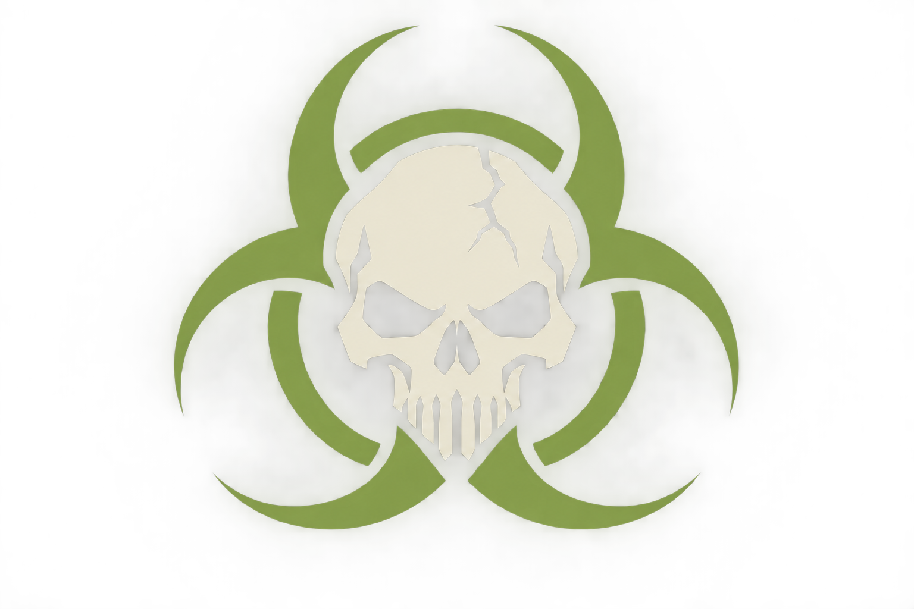

# Broken Arrow: Custom Nations 0.1.1

A MelonLoader addon for creating selectable nations and unit variants from existing Broken Arrow units. The included Zombies nation contains Walkers, Runners, Spitters, Smokers, Boomer, and Thrower, with Horde and Mutations specializations.

**Install [Local Skirmish](https://github.com/BovineOverlord/broken-arrow-local-skirmish) first to play custom nations in offline battles.** [Balance Mod](https://github.com/BovineOverlord/broken-arrow-balance-mod) is an optional companion, not a dependency.

**For modders: [Create a nation, step by step](docs/CREATING-A-NATION.md).** The guide includes a complete example JSON pack, every supported field, custom flags, ID allocation, deck creation, troubleshooting, and distribution advice. Pack authors do not need to compile C#.

## New in 0.1.1

- A custom skull and biohazard flag for Zombies.
- Optional `flag` paths for any nation pack, using PNG files inside the pack directory.
- Shared flag loading for synchronous and asynchronous game icon requests, with caching and stock-art fallback for invalid images.
- A complete [modder guide](docs/CREATING-A-NATION.md) and [second-nation example](examples/outbreak-colony.json).
- Upgrade handling that preserves existing pack JSON, costs, IDs, saved decks, and edited flag files. Old zombie packs receive the bundled flag without requiring JSON changes.



## Requirements

- **[Local Skirmish](https://github.com/BovineOverlord/broken-arrow-local-skirmish), tested with v2.6.3:** required for the supported offline battle workflow, including individual AI deck selection and custom ground-wave spawning. Custom Nations supplies nations, units, flags, and deck content; it does not provide its own battle launcher. Nation registration and deck editing can load without Local Skirmish, but the battle instructions below require it.
- **MelonLoader 0.7.3 and its generated game assemblies:** required to load Custom Nations. Follow Local Skirmish's setup instructions for MelonLoader and the offline modded launcher, then launch the modded game once before installing this addon. This build targets Broken Arrow 1.2.0.
- **[Balance Mod](https://github.com/BovineOverlord/broken-arrow-balance-mod): optional.** Use it for additional stat overrides and unit-data exports that can help pack authors find templates. Custom Nations sets its own pack-defined unit costs and does not require Balance Mod to register or play a nation. The observed gameplay tests used both companion mods installed.

## Installation and updating

For a first installation:

1. Install [Local Skirmish](https://github.com/BovineOverlord/broken-arrow-local-skirmish) and complete its modded-launcher setup.
2. Launch the modded game once so MelonLoader generates the required assemblies, then close it.
3. Optionally install [Balance Mod](https://github.com/BovineOverlord/broken-arrow-balance-mod).
4. Install Custom Nations using the command below, then launch with the existing offline modded shortcut.

Download this repository using **Code > Download ZIP**, then extract it. Close the game and run:

```powershell
powershell -ExecutionPolicy Bypass -File .\install.ps1 -GameDir "D:\Games\Broken Arrow"
```

The installer copies only this addon and its bundled flag/default pack. It backs up the previous Custom Nations DLL and preserves existing pack JSON and PNG files. It does not replace Local Skirmish or Balance Mod, download software, or change the game executable. Online play is not supported.

If you install by hand, copy `dist/BACustomNations.dll` to the game's `Mods` directory. The DLL contains the default zombie pack and flag and creates them if needed on startup. Your editable files live under `UserData/BACustomNations/packs`.

## Playing

1. Launch with your existing offline modded shortcut.
2. Create a deck in the normal deck builder. Select **Zombies**, **Horde**, and **Mutations**, add units, and save.
3. In Local Skirmish, select that saved deck for yourself or individual AI players.

All six custom units are Infantry, with an initial base cost of 40 and availability of eight each. The nation has a 2,000-point limit. These values are configurable starting values. Specialization icons and illustrations still use stock placeholders.

The automatic **Zombies - Starter** deck has a known native-validation issue and may not appear. Use the saved-deck workflow above. Version 0.1.1 does not change the starter generator or bypass game validation.

With the zombie pack's `mapGroundWaves` enabled, selected all-zombie AI decks can supply zombie replacements for ground waves across categories. Aircraft and helicopter requests retain Local Skirmish's matching rules. The map still controls orders, timing, and income, and scripted waves do not enforce finite card inventory.

## Making a nation

Follow [Creating a nation](docs/CREATING-A-NATION.md), or copy [outbreak-colony.json](examples/outbreak-colony.json) into the game's `UserData/BACustomNations/packs` folder for a minimal second nation. Restart the game after editing packs or artwork. The example is included for reference and is not installed automatically.

To use your own flag, put a PNG in `packs/assets` and add this field to your pack:

```json
"flag": "assets/my-nation-flag.png"
```

Use a clear design that reads at small sizes. PNG files must be at most 8 MiB, with each dimension no greater than 2048 pixels. A 3:2 flag is recommended. Missing or invalid flags fall back to stock artwork without disabling the nation. Full details are in the guide.

## Status and limitations

A saved custom zombie deck has been tested in local skirmish. Game logs confirm its assignment to players and AI waves spawning unit IDs 9490 through 9495. Native runtime diagnostics also confirmed separate custom unit identities, preserved stock IDs/categories, and cloned squad/weapon profiles. This does not establish that every zombie ability works outside its original mission.

Version 0.1.1 passes 40 managed checks and an installer check that preserves edited packs and flags. In a live launch, the game's normal, outline, and asynchronous icon loaders all returned the new zombie flag. The updated flag has not been visually reviewed in every game menu.

This remains a development release. It creates variants of existing templates without loadout modifications. New models, weapons, armor edits, animations, sounds, loadout replacement graphs, custom transports, infection scripts, and a graphical nation editor are not implemented.

`inventory.json` and `runtime-checks.json` under `UserData/BACustomNations` provide database and clone diagnostics. See `MelonLoader/Latest.log` for registration, flag loading, and starter-validation messages. The guide explains the known automatic-starter limitation separately from working saved decks.

To uninstall, close the game and remove `Mods/BACustomNations.dll`. Saved custom decks require the compatible addon and pack IDs; keep backups before removing or changing packs.

## Building and testing

Requires a .NET SDK and the game's generated MelonLoader assemblies. No game DLLs or extracted game assets are included.

```powershell
dotnet build src\BACustomNations.csproj -c Release -p:GameDir="D:\Games\Broken Arrow"
dotnet run --project tests\RulesTests.csproj -- packs\zombies.json
```

The project targets .NET 6 to match the loader. Managed checks cover definition validation, pack coexistence, wave-category selection, flag paths, and PNG header limits. They do not execute combat or verify every menu.

The bundled flag was made with the built-in image generation tool. Its prompt and provenance are in [Asset notes](docs/ASSETS.md).
